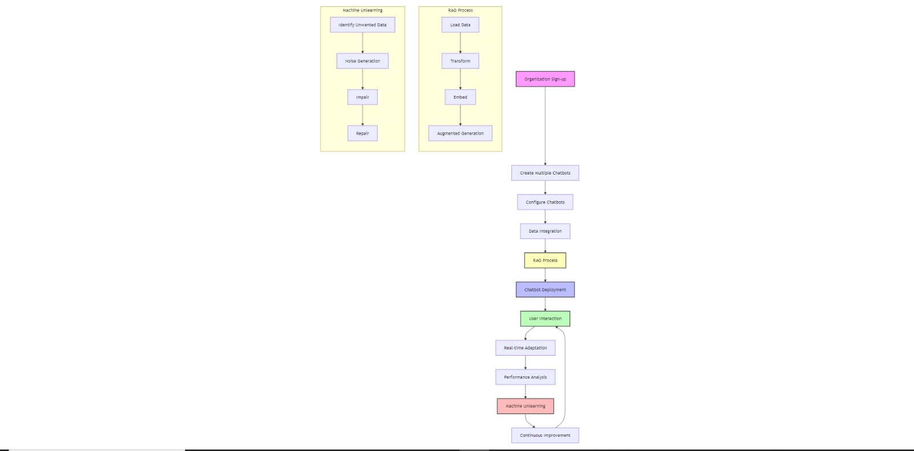

# RagAndUnlearn.ai

Problem Statement:
Organizations face significant challenges in managing and maintaining multiple chatbots across various departments and use cases. Current solutions often lack flexibility, real-time adaptability, and the ability to efficiently update or remove outdated or inappropriate information. This leads to inconsistent user experiences, increased maintenance overhead, and potential dissemination of inaccurate or unwanted information.

Key issues include:

Difficulty in managing multiple chatbots with different knowledge bases and purposes
Inability to quickly adapt chatbot responses to new information or changing circumstances
Challenges in removing or modifying specific pieces of knowledge without full retraining
Inconsistent performance across different chatbots within the same organization
High costs and resource requirements for maintaining up-to-date, accurate chatbot systems

Objectives:
The Multi-Chatbot Management System aims to address these challenges by providing a comprehensive SaaS solution with the following objectives:

Streamline the creation, deployment, and management of multiple chatbots within a single platform
Enhance chatbot performance and accuracy through Retrieval-Augmented Generation (RAG)
Implement Machine Unlearning capabilities for efficient removal or modification of specific information
Provide real-time adaptability to ensure chatbots remain current and relevant
Offer robust customization options to meet diverse organizational needs
Reduce the overall cost and complexity of maintaining multiple chatbot systems

Methodology:
The project employs a multi-faceted approach to solve the identified problems:

Multi-Chatbot Management:

Develop a centralized dashboard for creating and managing multiple chatbots
Implement role-based access control for collaborative management
Create APIs for seamless integration with existing systems

Retrieval-Augmented Generation (RAG):
a. Load:

Develop connectors for various data sources (databases, APIs, file systems)
Implement real-time data synchronization mechanisms
b. Transform:
Create pipelines for data cleaning, normalization, and preprocessing
Implement natural language processing techniques for entity recognition and metadata tagging
c. Embed:
Integrate state-of-the-art embedding models (e.g., BERT, GPT)
Develop efficient indexing and storage solutions for embeddings
d. Augmented Generation:
Implement a hybrid retrieval-generation model
Develop algorithms for context-aware information retrieval
Fine-tune base language models for domain-specific tasks

Machine Unlearning:
a. Noise Generation:

Develop algorithms for identifying target data for unlearning
Implement techniques for generating synthetic noise or perturbations
b. Impair:
Create methods for applying generated noise to model knowledge
Develop techniques to selectively weaken specific knowledge associations
c. Repair:
Implement fine-tuning processes on curated datasets
Develop evaluation metrics to ensure unlearning effectiveness

Real-Time Adaptation:

Implement continuous learning algorithms
Develop feedback loops for performance optimization
Create mechanisms for dynamic knowledge base updates

Analytics and Reporting:

Develop comprehensive analytics dashboards
Implement natural language understanding for sentiment analysis
Create automated reporting and insight generation systems

Scope of the Solution:
The Multi-Chatbot Management System will encompass:

A web-based SaaS platform accessible via modern browsers
Support for multiple chatbot instances per organization
Integration with popular messaging platforms and website widgets
Customizable chatbot personalities and response styles
Multi-language support for global organizations
Scalable cloud-based infrastructure for high availability and performance
Comprehensive API documentation for third-party integrations
Regular feature updates and performance improvements

Additional Relevant Details:

Technology Stack:

Backend: Python (FastAPI or Django), Node.js
Frontend: React.js, Next.js
Database: PostgreSQL, MongoDB
Vector Database: Pinecone or Weaviate
Machine Learning: PyTorch, Hugging Face Transformers
Cloud Infrastructure: AWS or Google Cloud Platform

Security Measures:

End-to-end encryption for data in transit and at rest
Regular security audits and penetration testing
Compliance with GDPR, CCPA, and other relevant data protection regulations

Pricing Model:

Tiered subscription plans based on the number of chatbots and usage volume
Optional add-ons for advanced features or increased capacity

Support and Documentation:

24/7 customer support via chat and email
Comprehensive documentation and tutorials
Regular webinars and training sessions for clients

Future Roadmap:

Integration with emerging AI technologies (e.g., few-shot learning, multi-modal models)
Expanded analytics and predictive capabilities
Enhanced collaboration features for large organizations

Potential Challenges:

Ensuring consistent performance across diverse domains and use cases
Balancing the trade-off between unlearning effectiveness and overall model performance
Managing the computational resources required for real-time adaptation and unlearning

By addressing these challenges and implementing the proposed solution, the Multi-Chatbot Management System aims to revolutionize how organizations create, manage, and optimize their chatbot ecosystems. The combination of RAG and Machine Unlearning technologies provides a unique advantage in maintaining up-to-date, accurate, and ethically aligned conversational AI systems
